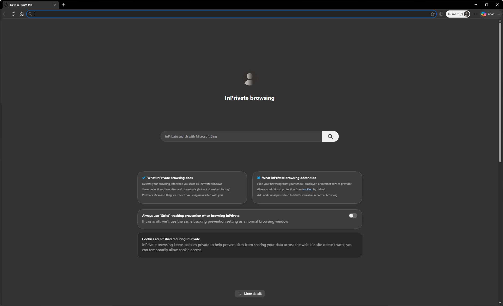
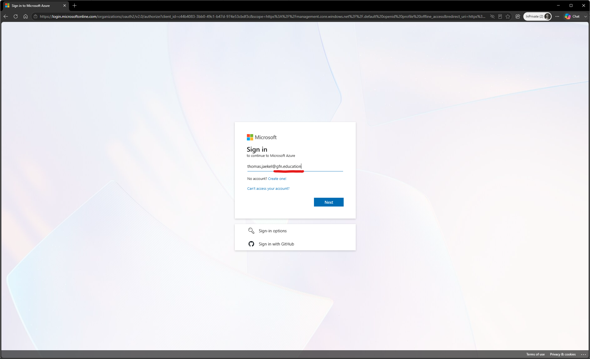
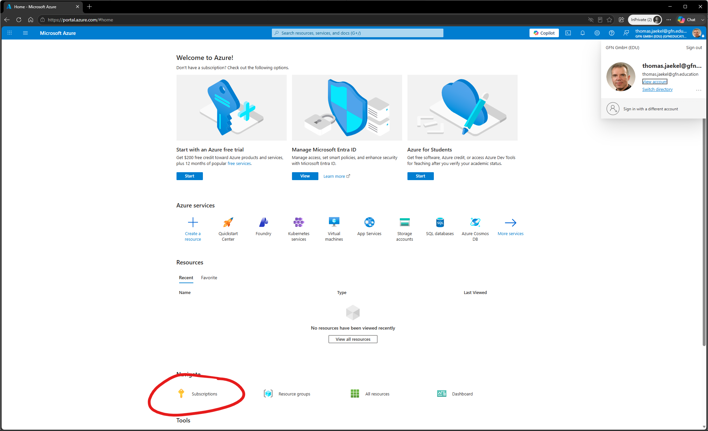
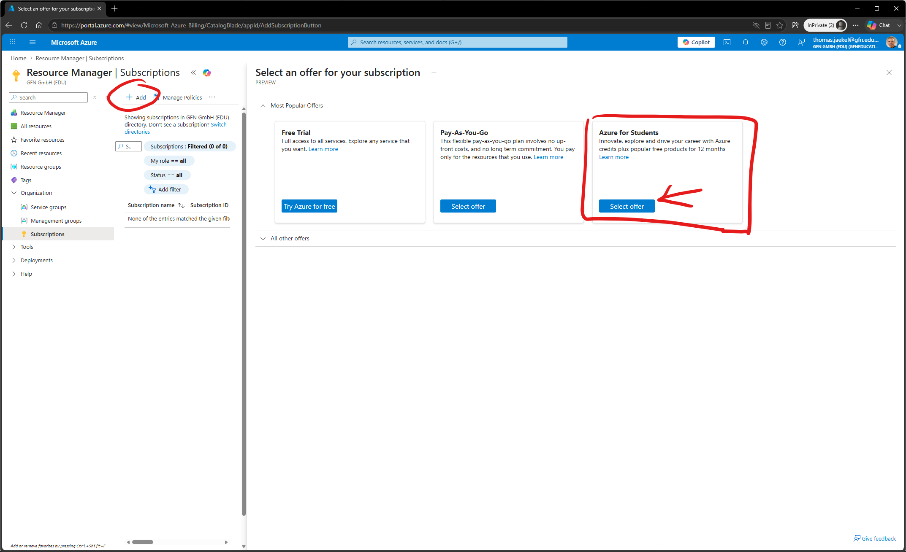
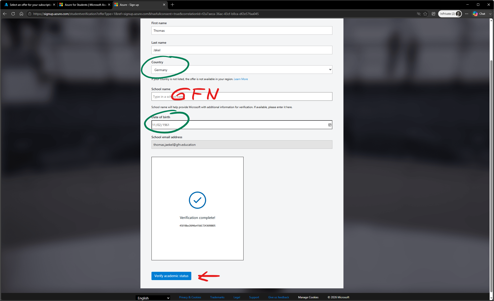
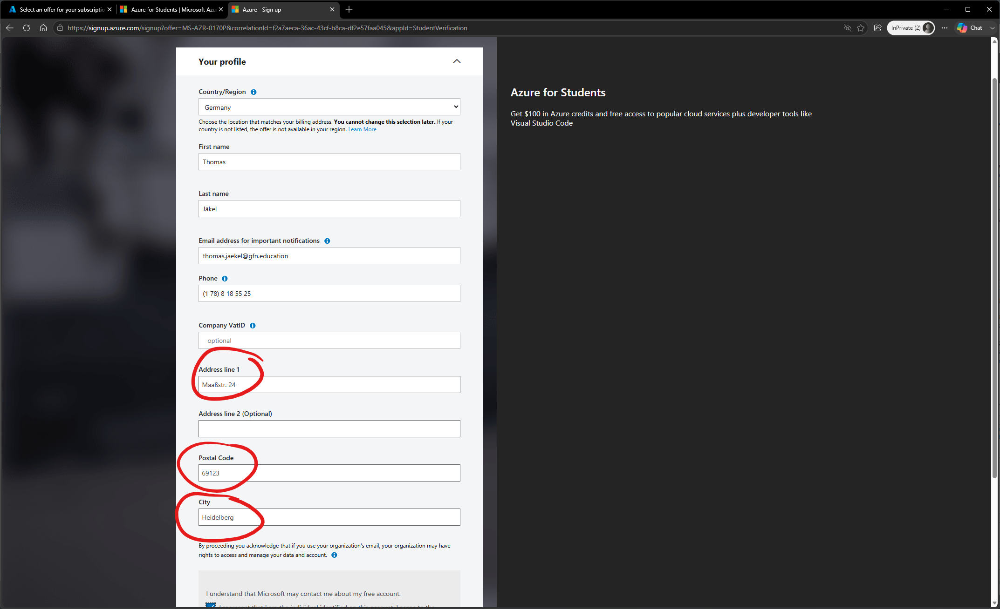
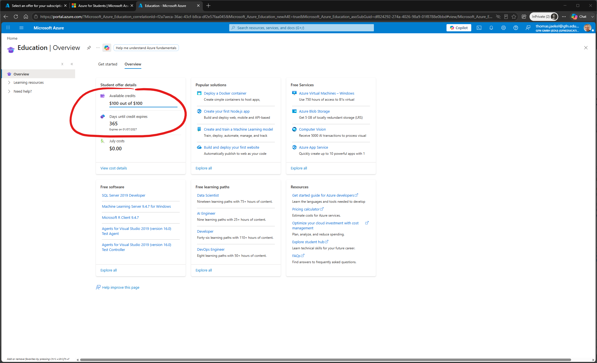
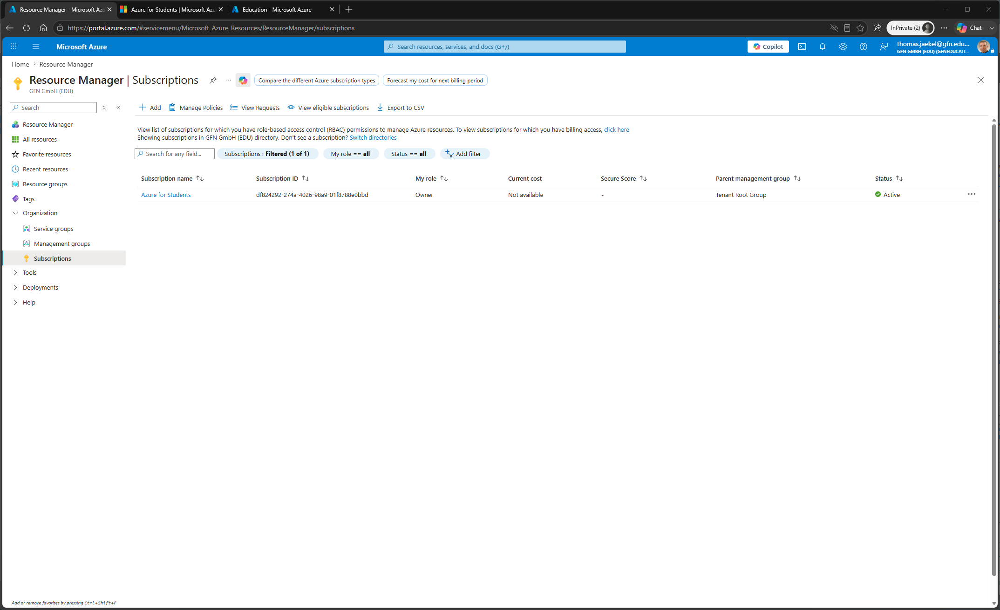
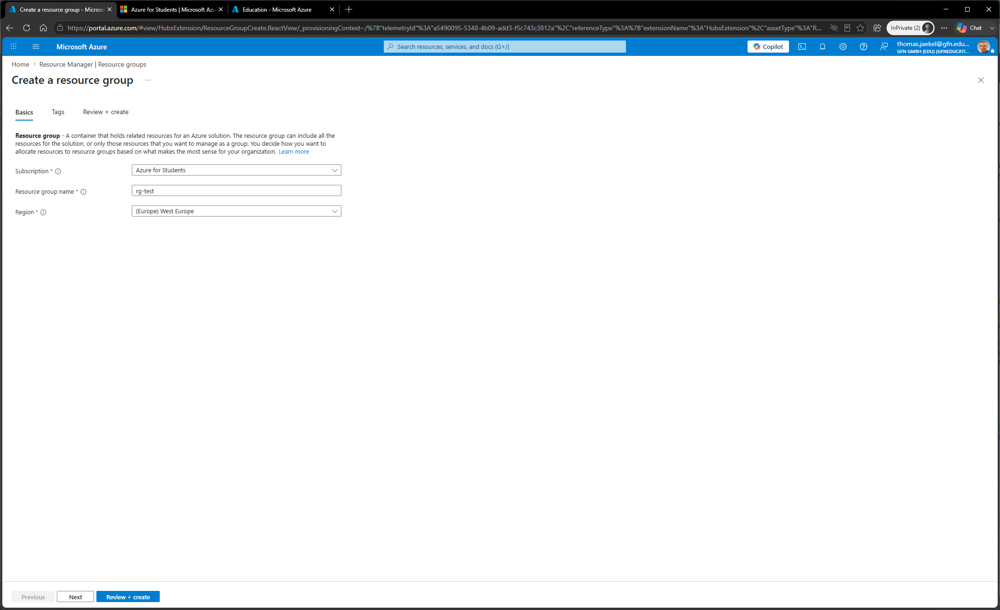
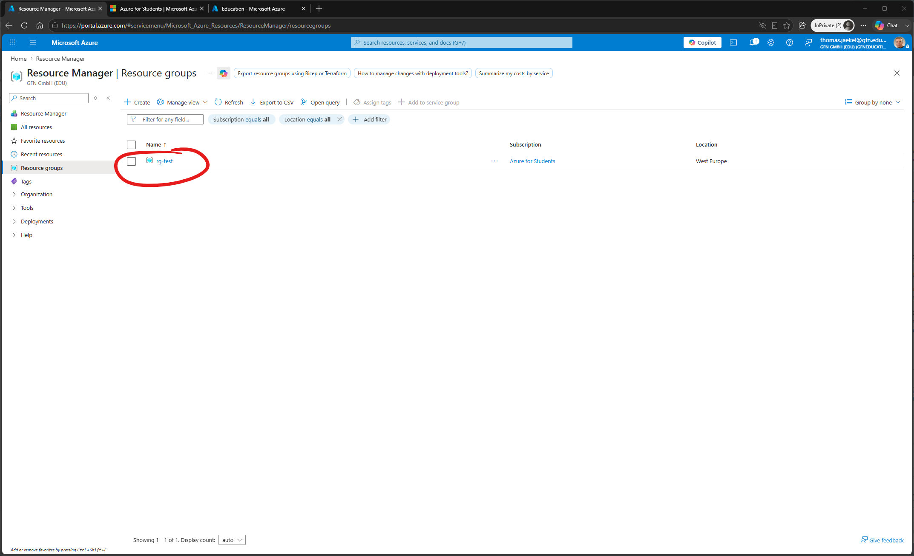

# Part 1 - Meine Subscription

## Browser InPrivate Window

Navigiere zum Azure Portal [https://portal.azure.com](https://portal.azure.com)

Sign in mit der **gfn.education** Adresse.

Achte auf **English** als Anzeigesprache!

Subscriptions suchen

 
Es gibt (noch) keine Subscriptions (Das ist normal.)

Click +Add und wähle *Azure for Students* 

Eine neue Web Site erscheint. Click Start free

## Academic Verification

* Country -> German
* School name -> GFN
* Date of birth -> *Your date of birth*

## Your profile

* Address line 1 -> Maaßstr. 24
* Postal Code -> 69123
* City -> Heidelberg

## Protect your account  

No more actions

## Education Overview 

* Available credits $100 out of $100  😀
* Days until credit expires 365 😀

## Azure Portal

Go back to Azure Portal -> Subscriptions (hit refresh)

Subscription *Azure for Students* appears 😀

Record your subscription id.

## Test

Create Resource Group 
* Name -> rg-test 
* Region -> West Europe

works as expected

