# Part 2 - Mein Tenant

## Create your own tenant

Go to the [Azure Portal](https:partal.azure.com)

Sign in with your gfn.education account.

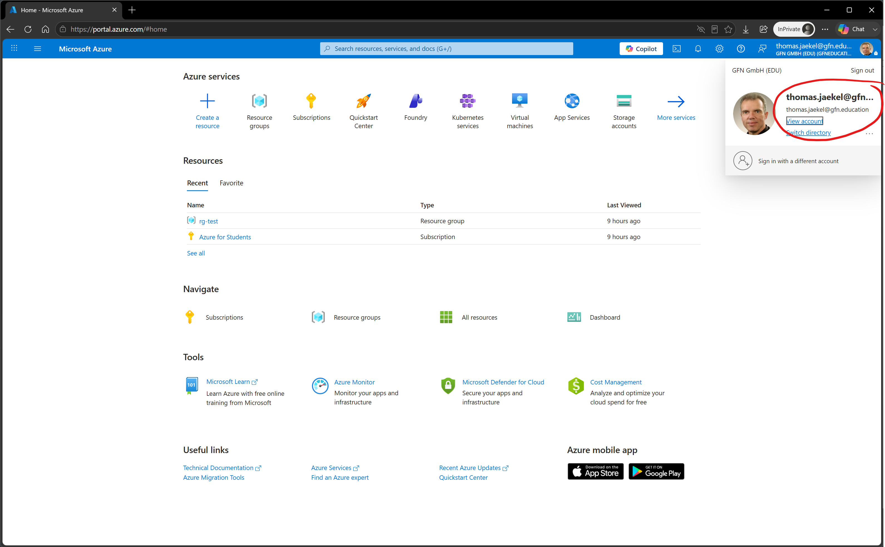

Enter URL 
```html
https://portal.azure.com/#view/Microsoft_AAD_IAM/CreateDirectoryBlade/releaseCreateOperation~/false
```

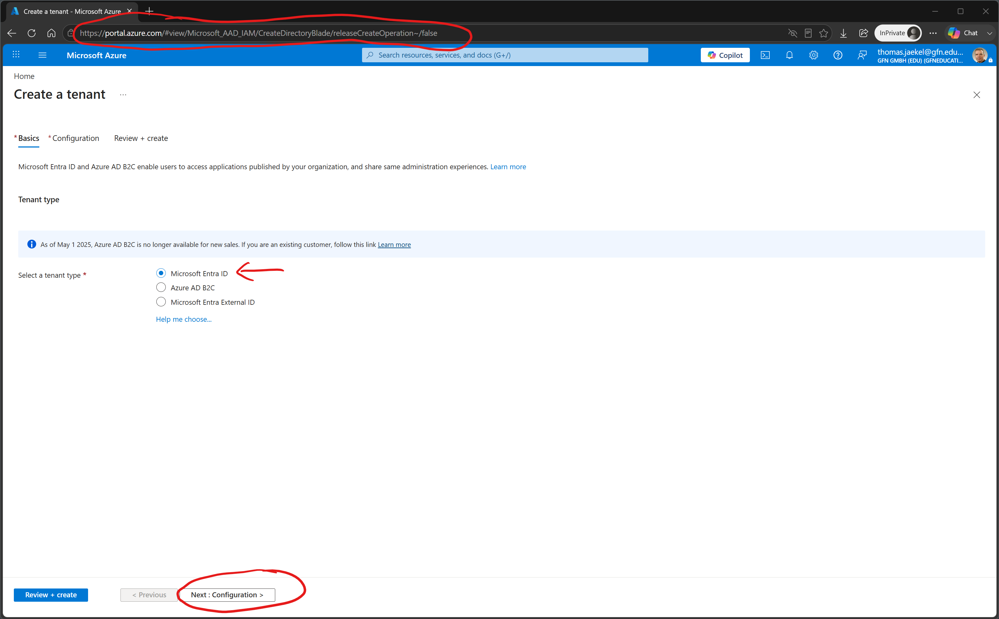

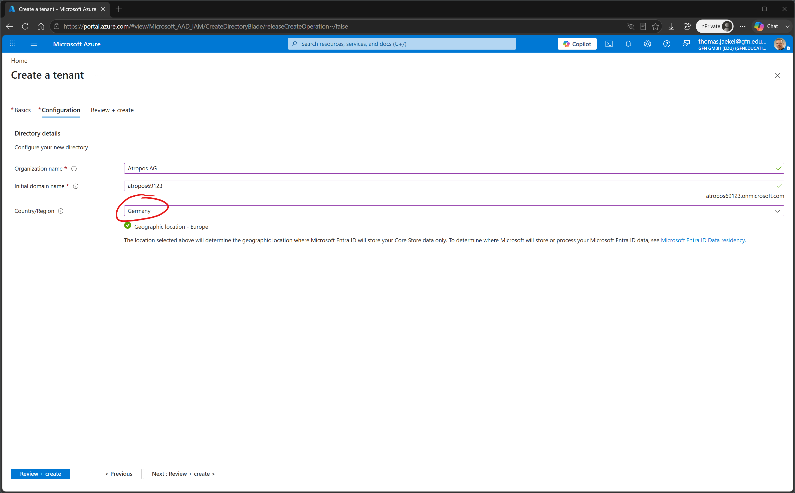

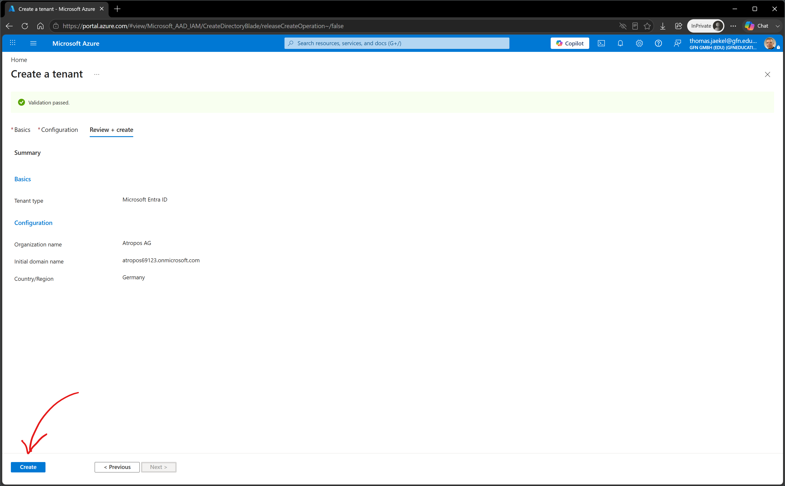

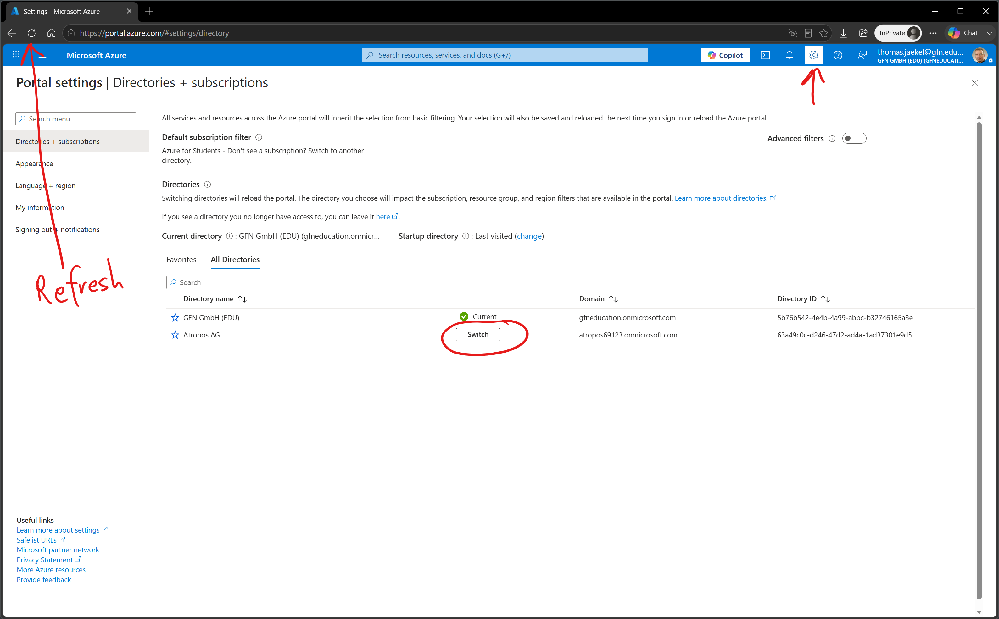

MFA einrichten (Microsoft Authenticator)

Zurückwechseln auf den GFN GmbH (EDU) Tenant

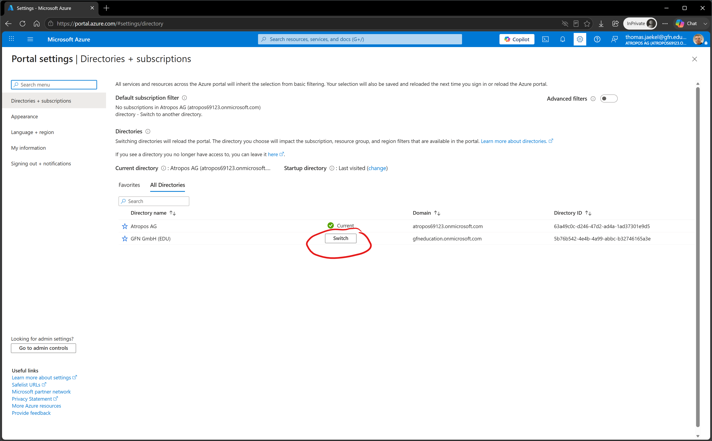

Zur Subscription gehen

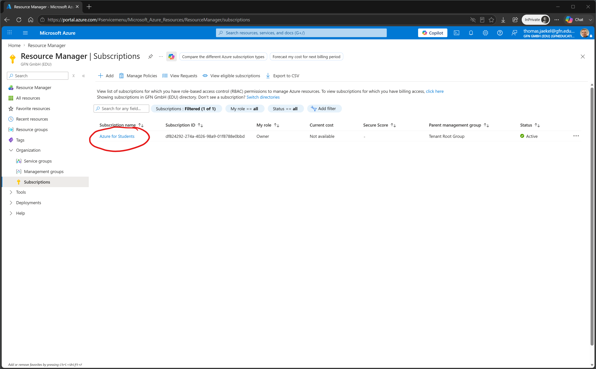

Change directory

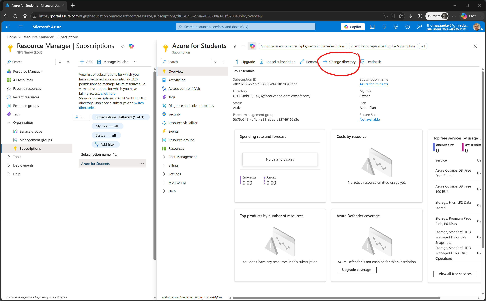

Ziel-Tenant sollte auftauchen

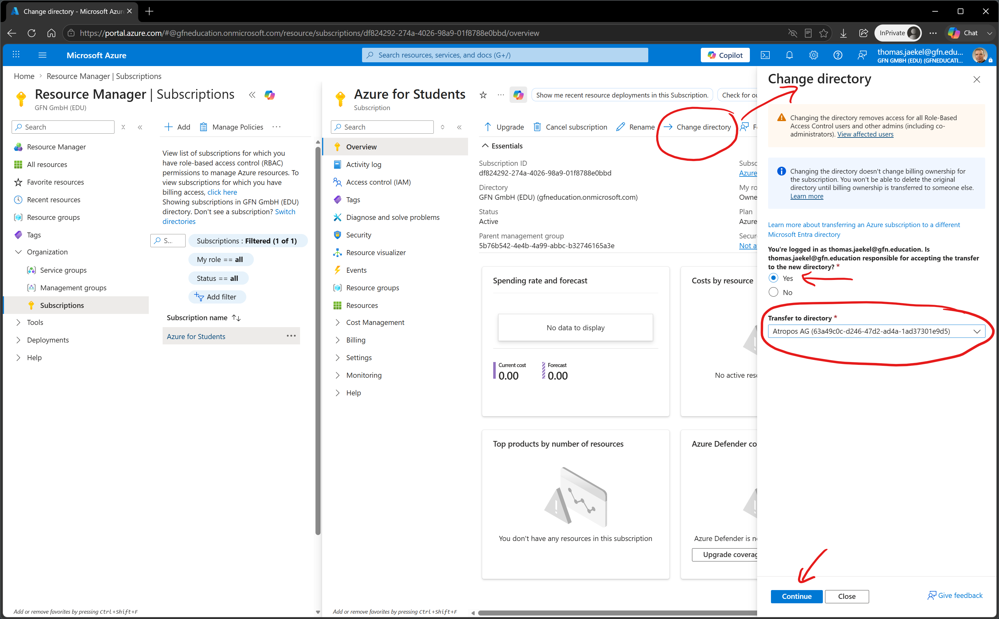

Continue transfer

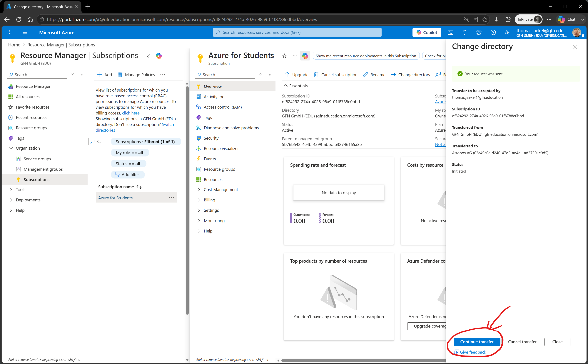

Error "Your current settings do not allow you to transfer this subscription. Contact your Global Administrator for access."

Go to Microsoft Entra ID Properties

Elevate yourself to User Access Administrator

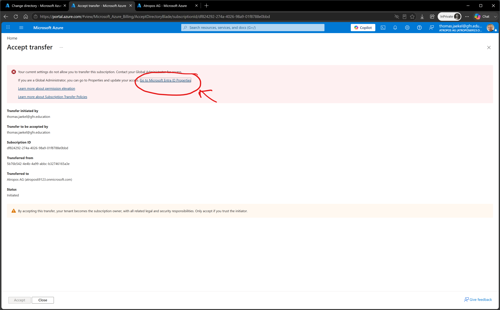

Try again 

Accept transfer

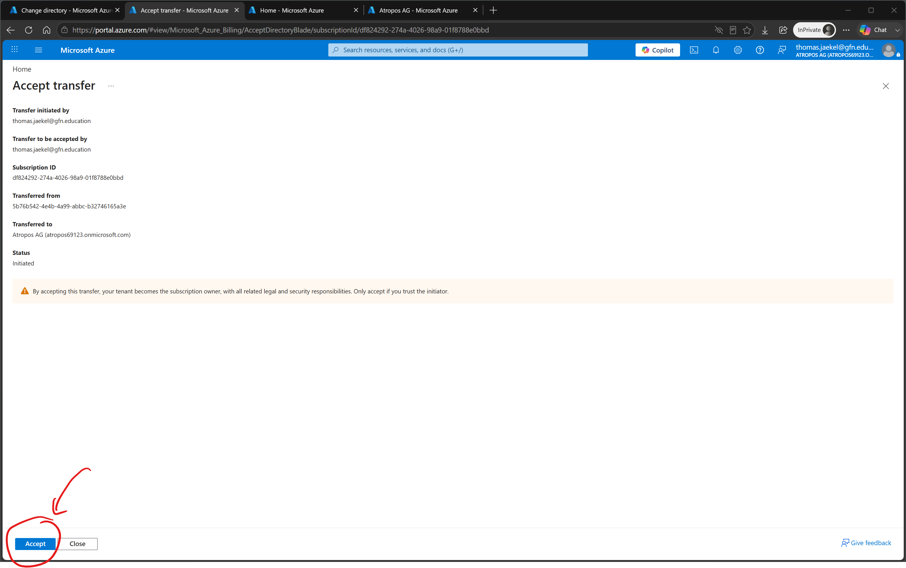

Status: In Progress

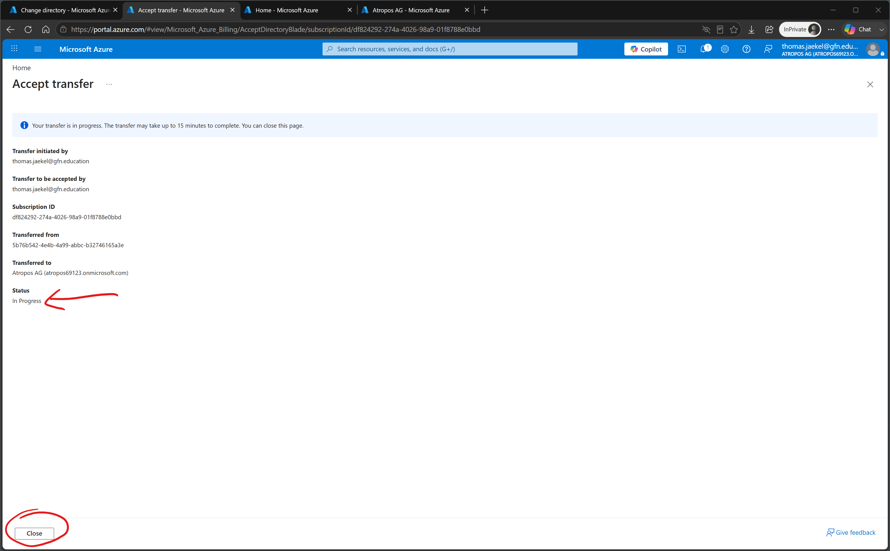

Fertig!

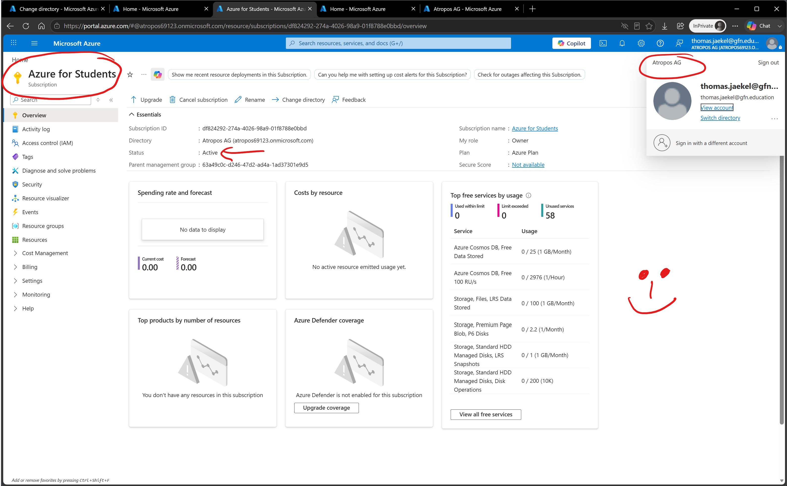
