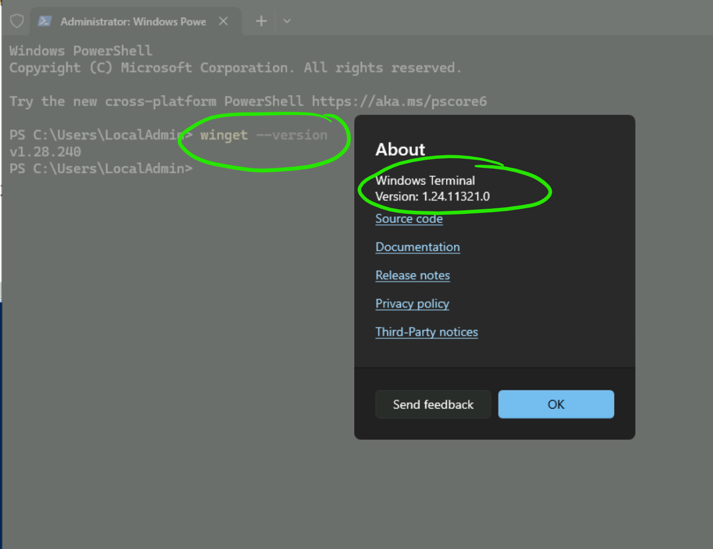
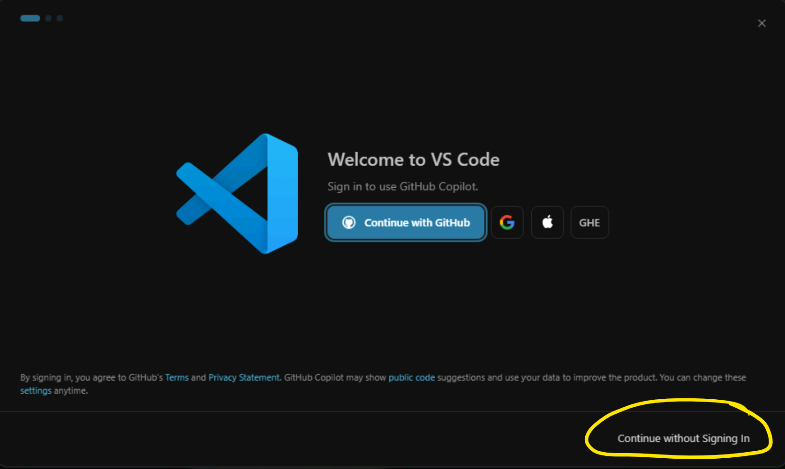

### 1. Start with Windows Terminal




### 2. Install VS Code and some more packages

```powershell
$packages = @(
    "Git.Git",
    "Microsoft.Bicep",
    "Microsoft.PowerShell",
    "Microsoft.VisualStudioCode"
)

foreach ($pkg in $packages) {
    Write-Host "Installing $pkg ..." -ForegroundColor Cyan
    winget install --id $pkg --exact --silent --accept-package-agreements --accept-source-agreements
}
```

### 3. Configure VS Code

- Ignore GitHub Copilot


